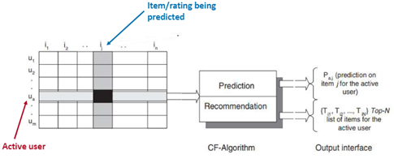

# Recommender-System(s)

Recommender System 2022-2023  
Third Year Recommender System project just before my personal break from University to continue final year again in 2023-2024  
Includes both personalized and non-personalized Recommender Systems
## Running the Recommender System

To run the Recommender System, open the Python file in a command line and run `python RS.py` or use an equivalent Python IDE.

### Inputs
- **Input 1:** Asks for `userId`, the number of users to compare against (kNN), and the number of movies to recommend.
- **Input 2:** Asks for `userId` and the number of movies to recommend.
- **Input 3:** Exits the program.

### Notes
The Jupyter Notebook included in the project shows the process and separates personalized and non-personalized recommender systems for easier viewing and understanding of the implementation.

## Methodology

### Data Source
The dataset used for this project is the MovieLens dataset from GroupLens, which includes files like `ratings.csv`, `tags.csv`, `movies.csv`, and `links.csv`. The `ratings.csv` and `movies.csv` files are the primary sources for this recommender system.

### Data Preparation
1. **Data Cleaning:** Duplicate entries in `movies.csv` were removed. The `genres` and `timestamp` columns were dropped from `movies.csv` and `ratings.csv`, respectively.
2. **Data Merging:** The `movies.csv` and `ratings.csv` files were merged on `movieId`.
3. **Pivot Table Creation:** A pivot table was created with `userId` as rows, movie titles as columns, and ratings as values. NaN values were filled with zeros.
4. **Sparse Matrix:** The pivot table was converted into a sparse matrix for efficient computations.

### Personalized Recommender System
A non-probabilistic model-based collaborative filtering approach was employed. 
 
Using the K-Nearest Neighbors (KNN) algorithm. 
 

1. **Model Selection:** KNN was chosen due to its ability to handle the similarities between users and items without making assumptions about data distribution.
2. **Similarity Metric:** Cosine similarity was used to measure the similarity between users and movies.
3. **Weight Assignment:** Weights were assigned to user ratings based on their distance from the target user, improving the recommendation accuracy.
4. **Implementation Steps:**
   - Fit the KNN model to the sparse matrix.
   - Obtain a list of similar users and their distances.
   - Define the weight of the rating based on the distance from the actual user.
   - Broadcast the weightage matrix to match the user's rating matrix for matrix operations.

### Non-Personalized Recommender System
For the non-personalized recommender system, the merged dataset was used directly without converting it into a matrix. The system recommends movies based on the highest average ratings across all users.

### Evaluation
The performance of the recommender systems was evaluated using explainability as the metric. Both personalized and non-personalized systems were tested with specific user inputs to compare the quality of recommendations.